# ERINDE – Project Overview

> **A complete reference for engineers, developers, and non-technical stakeholders.**

---

## Table of Contents

1. [What Is ERINDE? (Non-Technical Summary)](#1-what-is-erinde-non-technical-summary)
2. [High-Level System Overview](#2-high-level-system-overview)
3. [Who Uses the System? (User Roles)](#3-who-uses-the-system-user-roles)
4. [How It Works – End-to-End Journey](#4-how-it-works--end-to-end-journey)
5. [System Architecture (Technical)](#5-system-architecture-technical)
6. [Database Schema](#6-database-schema)
7. [API Endpoints at a Glance](#7-api-endpoints-at-a-glance)
8. [Authentication & Security Flow](#8-authentication--security-flow)
9. [Assessment Classification Logic](#9-assessment-classification-logic)
10. [Referral Workflow](#10-referral-workflow)
11. [Project File Structure](#11-project-file-structure)
12. [Tech Stack Summary](#12-tech-stack-summary)

---

## 1. What Is ERINDE? (Non-Technical Summary)

**ERINDE** is a digital health platform designed for community health management in **Rwanda**. It helps health workers screen patients in the community, automatically analyse health readings, and connect at-risk patients to the right medical facility — all without manual paperwork.

### The Problem It Solves

In Rwanda, community health workers visit patients at home or in village health posts. They measure things like blood pressure, weight, or blood sugar. Traditionally, deciding what to do with those results — and getting a patient seen at a hospital — relied on manual processes that were slow and error-prone.

### What ERINDE Does

| What | How |
|------|-----|
| **Records health readings** | Health workers enter measurements on a device |
| **Automatically analyses results** | The system classifies readings as healthy, warning, or critical |
| **Recommends next steps** | Based on the classification, the system suggests clinical actions |
| **Creates referrals automatically** | If a patient needs hospital care, a referral is generated instantly |
| **Routes patients to the right facility** | From Community Health Unit → Health Center → Hospital |
| **Tracks follow-ups** | Nurses at hospitals can see referrals and mark them complete |
| **Supports two languages** | English and Kinyarwanda |

### Key Benefits for Stakeholders

- ✅ Reduces delays in getting patients the right care
- ✅ Eliminates manual paperwork and phone-based referrals
- ✅ Gives administrators a real-time view of community health
- ✅ Helps nurses prioritise who to see next
- ✅ Ensures no patient is missed — the system guards against duplicate or premature re-assessments

---

## 2. High-Level System Overview

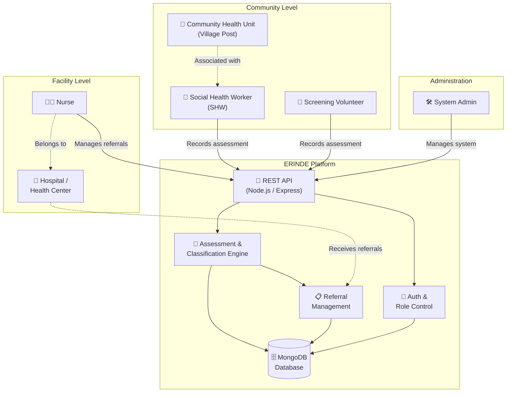

---

## 3. Who Uses the System? (User Roles)

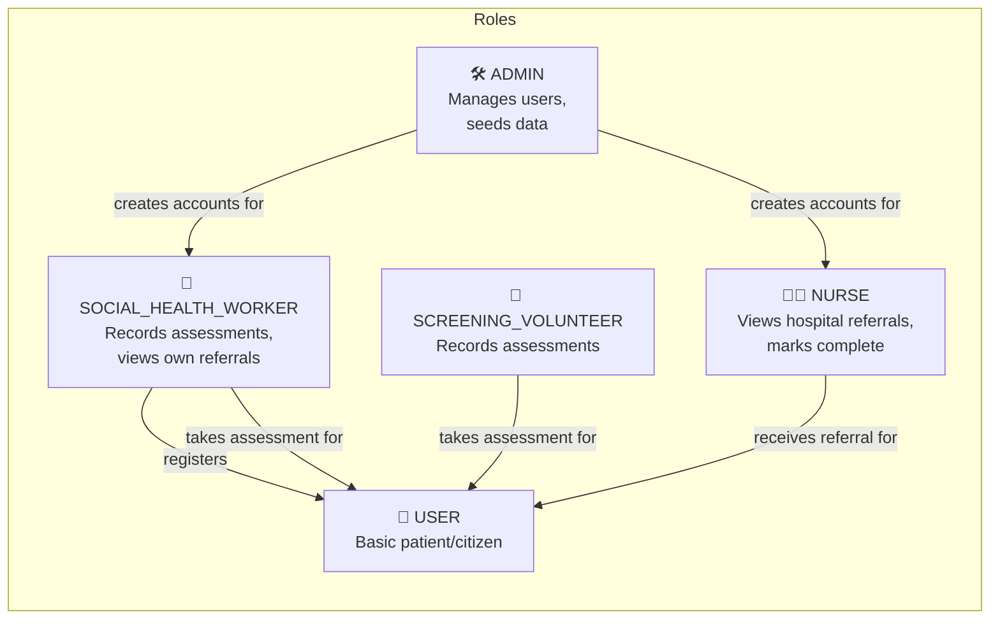

| Role | Can Do |
|------|--------|
| **ADMIN** | Create user accounts, manage system data |
| **SOCIAL_HEALTH_WORKER** | Register patients, record assessments, view own referrals & upcoming visits |
| **SCREENING_VOLUNTEER** | Record assessments for patients |
| **NURSE** | View referrals assigned to their hospital, mark as complete |
| **USER** | Basic record — no login by default |

---

## 4. How It Works – End-to-End Journey

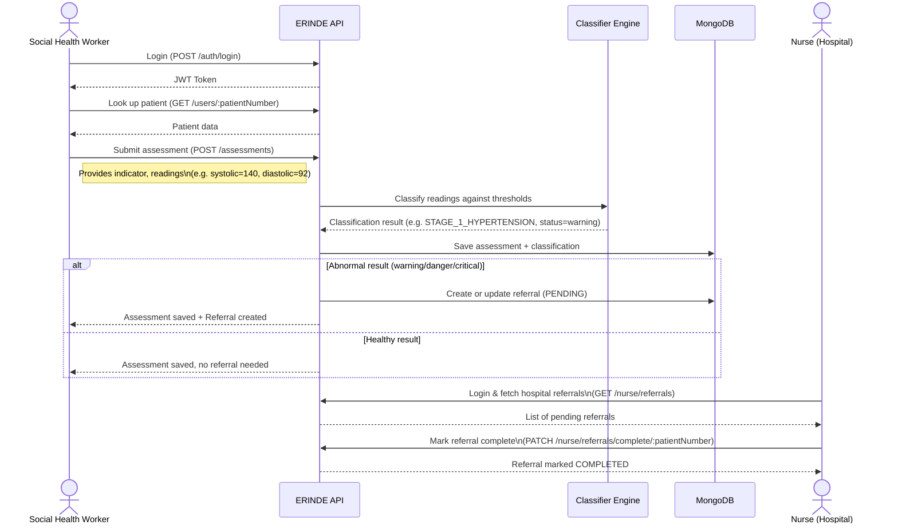

---

## 5. System Architecture (Technical)

### Layered Architecture

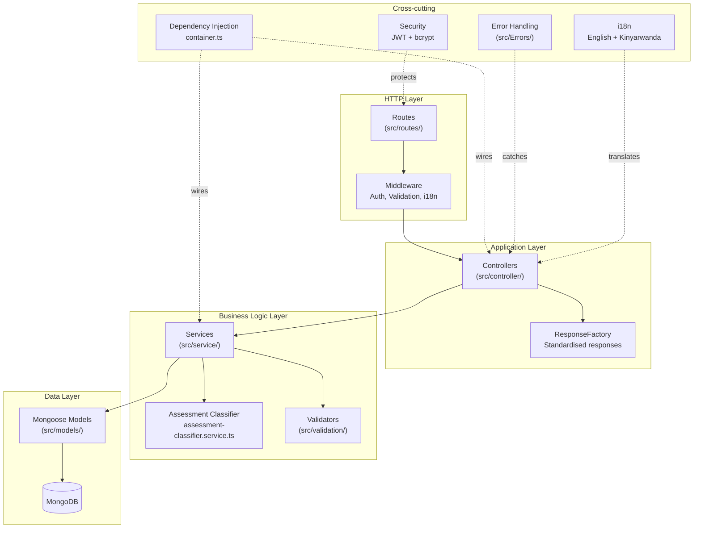

### Request Lifecycle

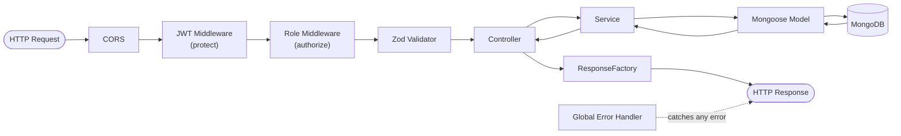

---

## 6. Database Schema

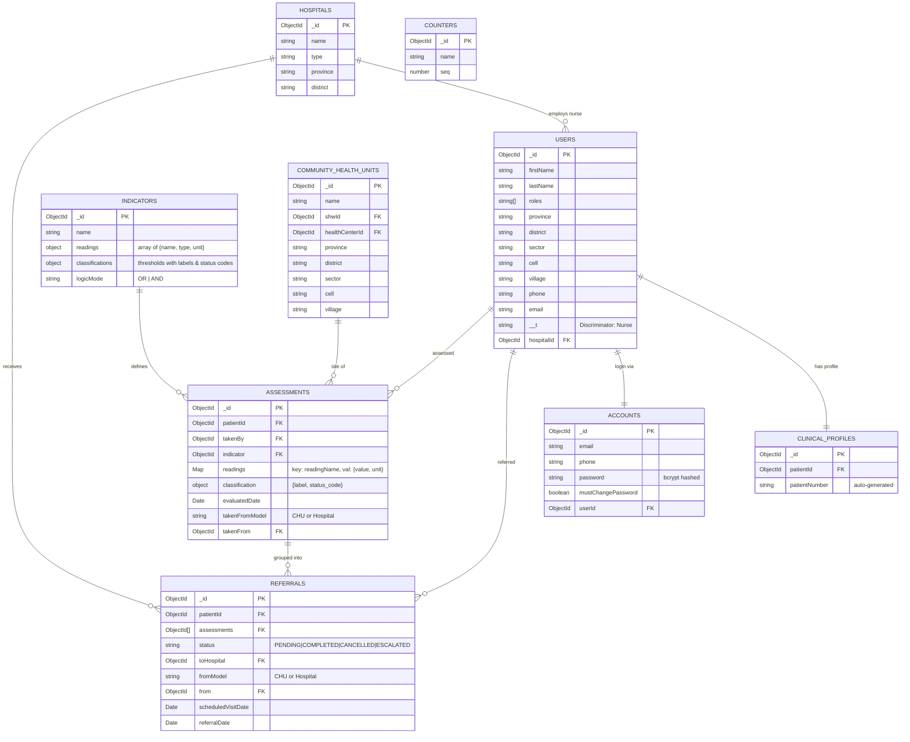

---

## 7. API Endpoints at a Glance

**Base URL:** `POST /api/v1`

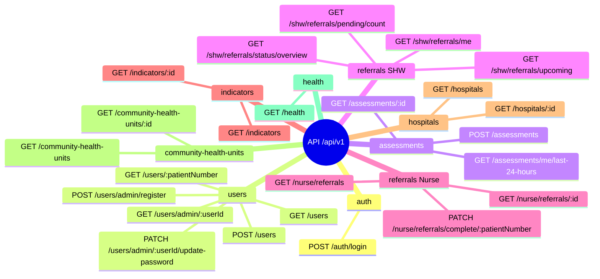

### Role × Endpoint Access Matrix

| Endpoint Group | ADMIN | SHW | VOLUNTEER | NURSE |
|---|:---:|:---:|:---:|:---:|
| `POST /auth/login` | ✅ | ✅ | ✅ | ✅ |
| `POST /users` (register patient) | — | ✅ | ✅ | — |
| `POST /users/admin/register` | ✅ | — | — | — |
| `POST /assessments` | ✅ | ✅ | ✅ | ✅ |
| `GET /assessments/me/last-24-hours` | — | ✅ | — | — |
| `GET /shw/referrals/*` | — | ✅ | — | — |
| `GET /nurse/referrals` | — | — | — | ✅ |
| `PATCH /nurse/referrals/complete/*` | — | — | — | ✅ |
| `GET /indicators` | ✅ | ✅ | ✅ | ✅ |
| `GET /hospitals` | ✅ | ✅ | ✅ | ✅ |

---

## 8. Authentication & Security Flow

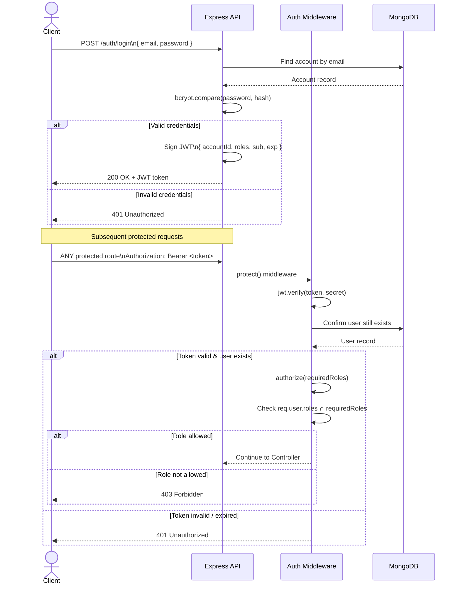

---

## 9. Assessment Classification Logic

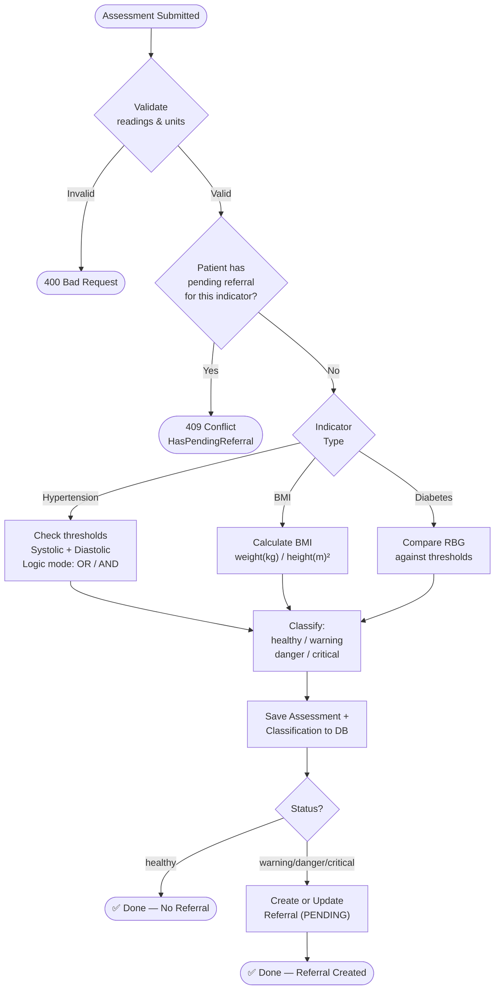

### Status Codes

| Status | Meaning | Action |
|--------|---------|--------|
| `healthy` | All readings within normal range | No referral |
| `warning` | Mild deviation from normal | Referral created |
| `danger` | Significant deviation | Referral created |
| `critical` | Severe / immediate risk | Referral created (urgent) |

---

## 10. Referral Workflow

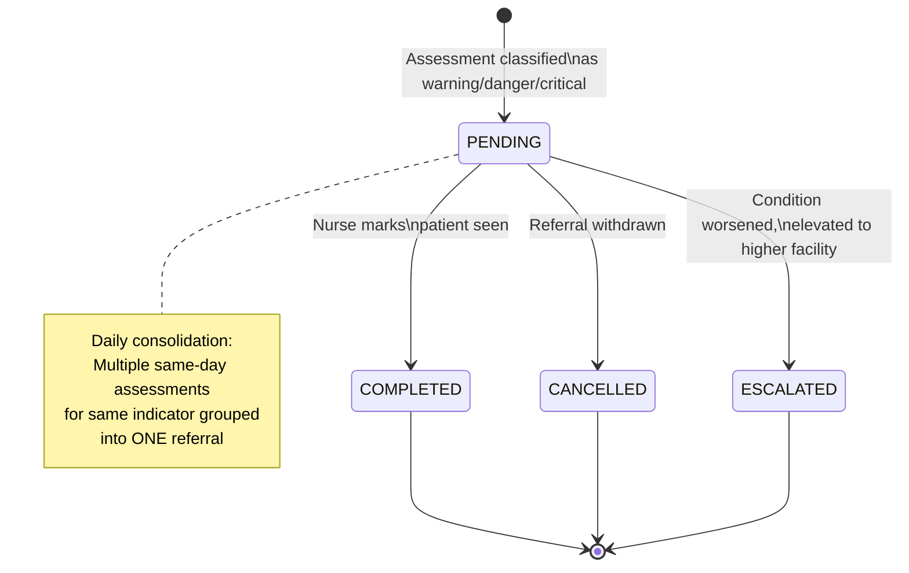

### Referral Routing

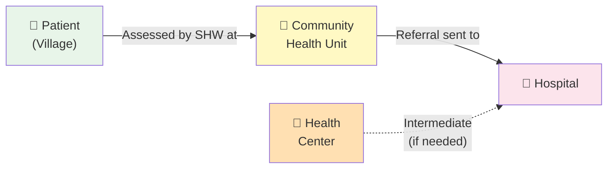

---

## 11. Project File Structure

```
erinde/
├── src/
│   ├── index.ts                  # 🚀 App entry point (starts server)
│   ├── app.ts                    # Express app configuration & middleware
│   ├── container.ts              # Dependency injection wiring
│   ├── i18n.ts                   # i18n setup (EN + Kinyarwanda)
│   │
│   ├── routes/                   # 🔀 URL → Controller mapping
│   ├── controller/               # 📥 HTTP request/response handlers
│   ├── service/                  # 🧠 Business logic
│   │   ├── interface/            #     Service contracts (TypeScript interfaces)
│   │   └── assessment-classifier.service.ts  # Health classification engine
│   │
│   ├── models/                   # 🗄️ Mongoose schemas & DB models
│   ├── validation/               # ✅ Zod input validation schemas
│   ├── dto/                      # 📦 Data Transfer Objects
│   ├── domain/                   # 📐 Core TypeScript domain types
│   ├── types/                    # 🏷️ Shared TypeScript type definitions
│   ├── security/                 # 🔐 JWT utils & auth middleware
│   ├── Errors/                   # ❌ Custom error classes
│   ├── middleware/               # 🔧 Express middleware
│   ├── utils/                    # 🛠️ Shared utilities
│   ├── constants/                # 📌 App-wide constants
│   ├── locale/                   # 🌍 Translation files (en.json, rw.json)
│   ├── seed/                     # 🌱 Database seed scripts
│   └── test/                     # 🧪 Tests (26 test files)
│       ├── service/
│       └── fixtures/
│
├── docs/                         # 📚 Documentation
│   ├── PROJECT_OVERVIEW.md       # ← You are here
│   ├── technical-overview.md
│   ├── api.md                    # Full API reference
│   └── assessment-business-logic.md
│
├── package.json                  # Node project config & scripts
├── tsconfig.json                 # TypeScript config
├── vitest.config.ts              # Test runner config
└── Jenkinsfile                   # CI/CD pipeline definition
```

---

## 12. Tech Stack Summary

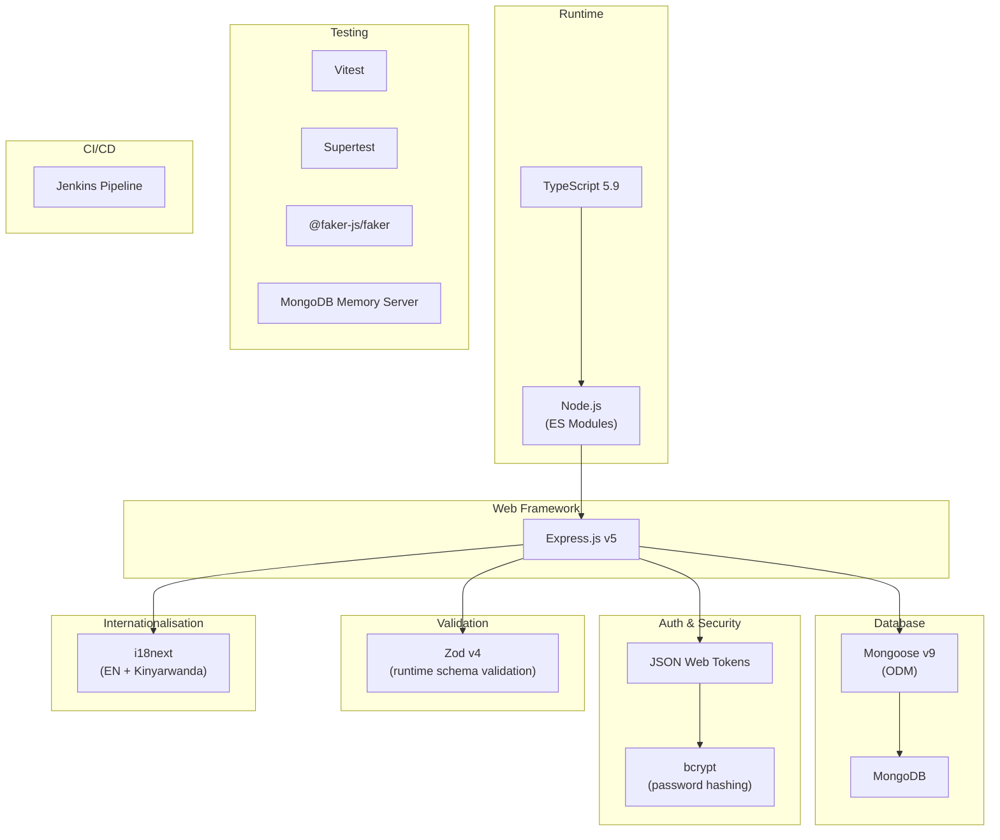

| Layer | Technology | Version |
|---|---|---|
| Runtime | Node.js + TypeScript | TS 5.9.3 |
| HTTP Framework | Express.js | 5.2.1 |
| Database | MongoDB + Mongoose | Mongoose 9.1.1 |
| Auth | JSON Web Tokens | 9.0.3 |
| Password Hashing | bcrypt | 6.0.0 |
| Validation | Zod | 4.3.4 |
| i18n | i18next | 25.8.13 |
| Testing | Vitest + Supertest | Vitest 4.0.16 |
| CI/CD | Jenkins | — |

---

*Last updated: March 2026*
