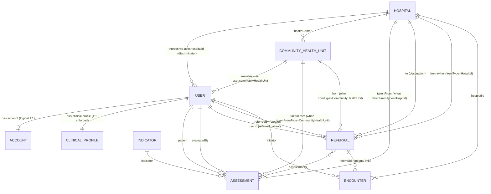

# Erinde Database Design (MongoDB + Mongoose)

This document describes the current persisted data model, with explicit relationships and constraints for engineering use.

## 1) Database Overview

- **Database type:** MongoDB (document database)
- **ODM:** Mongoose
- **Modeling style:** Mostly normalized references between collections, with selected denormalized fields for performance/workflows (for example `patientNumber` in multiple collections).

---

## 2) Collections and Purpose

1. **users**
   - Stores people in the system (patients and staff).
   - Uses a discriminator for **Nurse** records (`role = "NURSE"`) that include `hospitalId`.

2. **accounts**
   - Authentication credentials and account state.
   - Linked to a user by `userId`.

3. **clinicalprofiles**
   - Clinical identity mapping (`userId` ↔ `patientNumber`).
   - Core bridge for patient lookup by patient number.

4. **hospitals**
   - Facility records (health center, district/provincial/referral hospital, etc.).

5. **communityhealthunits**
   - Community-level units.
   - Linked to one health center (`healthCenter` → Hospital).
   - Optionally linked to a social health worker (`socialHealthWorker` → User).

6. **indicators**
   - Assessment definitions (reading types, units, classifications, recommendation rules).

7. **assessments**
   - Measured values/classification outcomes for a patient on an indicator.
   - Supports dynamic source location (`takenFrom` + `takenFromType`: Hospital or CommunityHealthUnit).

8. **referrals**
   - Referral records for patient movement/coordination.
   - Supports dynamic source (`from` + `fromType`: Hospital or CommunityHealthUnit).
   - Destination is always a hospital (`to`).

9. **encounters**
   - Active/closed care episodes at a hospital.
   - Optionally linked to a referral.

10. **counters**
    - Generic sequence counters.
    - Used for patient number generation (`_id = "patientNumber"`).

---

## 3) Entity-Relationship Diagram

---

## 4) Relationship Details and Cardinality

### A. User and Identity

- **User → ClinicalProfile**
  - `clinicalprofiles.userId` is **unique** and required.
  - `clinicalprofiles.patientNumber` is **unique** and indexed.
  - Result: strict **1:1** mapping between user and patient number.

- **User → Account**
  - `accounts.userId` is required reference.
  - Service logic creates account together with user; intended as **1:1**.
  - Note: uniqueness on `accounts.userId` is not DB-enforced currently.

### B. Organizational Structure

- **Hospital → CommunityHealthUnit**
  - `communityhealthunits.healthCenter` (required) points to `hospitals`.
  - Cardinality: one hospital can serve many CHUs.

- **CommunityHealthUnit → User (social health worker assignment)**
  - `communityhealthunits.socialHealthWorker` optional ref to `users`.
  - Semantically a CHU has 0..1 assigned SHW; assignment is managed in service workflow.

- **CommunityHealthUnit → Users (residency/coverage)**
  - `users.communityHealthUnit` required.
  - Many users can belong to one CHU.

- **Hospital → Nurses**
  - Nurse is a user discriminator with `hospitalId`.
  - One hospital can have many nurses.

### C. Clinical Data

- **Indicator → Assessment**
  - `assessments.indicator` required ref to `indicators`.
  - Many assessments per indicator.

- **User (patient) → Assessment**
  - `assessments.patient` required ref to `users`.
  - Many assessments per patient.
  - Unique compound index: `(patient, indicator, evaluatedDate)` limits to one assessment per indicator per patient per day.

- **Assessment source (`takenFrom`)**
  - Dynamic reference controlled by `takenFromType`.
  - `takenFromType = Hospital` ⇒ `takenFrom` references `hospitals`.
  - `takenFromType = CommunityHealthUnit` ⇒ `takenFrom` references `communityhealthunits`.

### D. Referral and Encounter Flow

- **Referral patient linkage**
  - `referrals.userId` required ref to `users`.
  - `referrals.patientNumber` denormalized for fast lookup.

- **Referral creator**
  - `referrals.referredBy` required ref to `users`.

- **Referral route**
  - `referrals.to` required ref to `hospitals`.
  - `referrals.from` is dynamic via `fromType` (Hospital or CommunityHealthUnit).

- **Referral assessments**
  - `referrals.assessments` stores referenced assessment IDs.
  - One referral can aggregate multiple assessments.

- **Encounter linkage**
  - `encounters.referralId` optional ref to `referrals`.
  - Encounter always belongs to a hospital (`hospitalId`) and has an initiator user (`initiator`).
  - Business rule enforced by index: one open encounter per patient at a time.

---

## 5) Key Indexes and Integrity Rules

### users
- Unique: `contact.phone`
- Sparse unique: `contact.email`
- Unique: `nationalIdentificationNumber`
- Partial unique: one `SOCIAL_HEALTH_WORKER` per `address.village`

### accounts
- Unique: `phoneNumber`
- Partial unique: `email` when email is a string

### clinicalprofiles
- Unique: `userId`
- Unique + indexed: `patientNumber`

### communityhealthunits
- Unique compound address index:
  - province + district + sector + cell + village

### assessments
- Index: `(patient, evaluatedAt desc)`
- Unique compound: `(patient, indicator, evaluatedDate)`

### referrals
- Partial unique: `(userId, status)` where `status = "PENDING"` (at most one pending referral per user)

### encounters
- Queue index: `(state, hospitalId, currentStep, urgency, openedAt)`
- Partial unique: `patientNumber` where `state = "open"` (single open encounter per patient)

---

## 6) Practical Notes for Engineers

- `patientNumber` is a cross-collection business key generated from `counters`.
- Dynamic references (`refPath`) are used in both **assessments** and **referrals**; always validate `*Type` + id pair together.
- Some 1:1 relationships are enforced by application workflow but not by unique DB index (notably `accounts.userId`).
- Referral and encounter lifecycle state transitions are central to workflow consistency; relationship integrity relies on service-level transaction usage.
