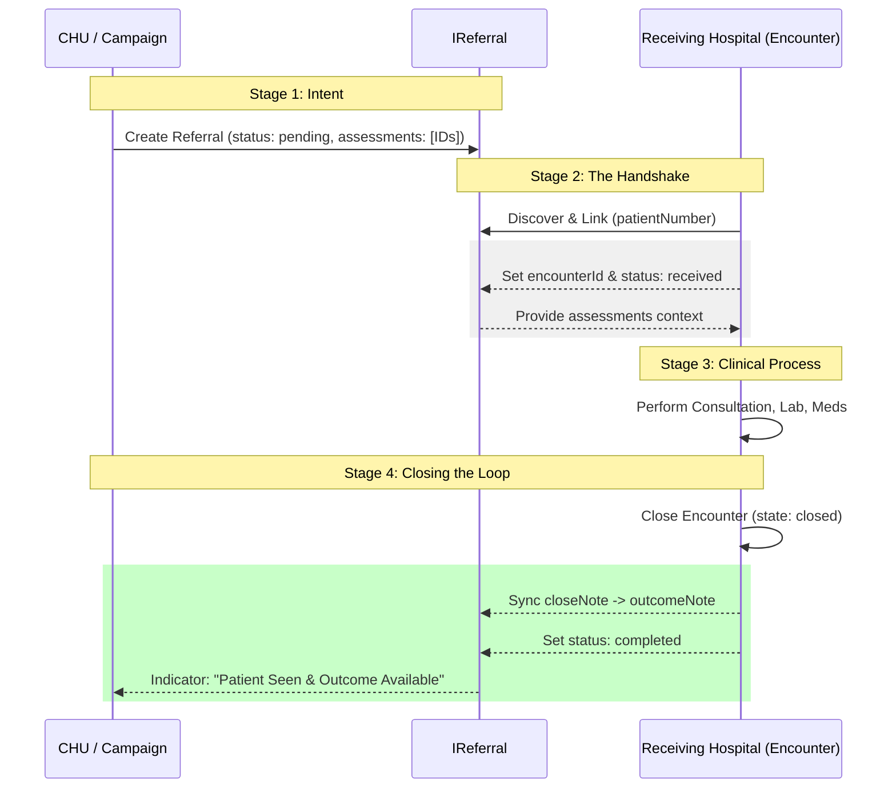
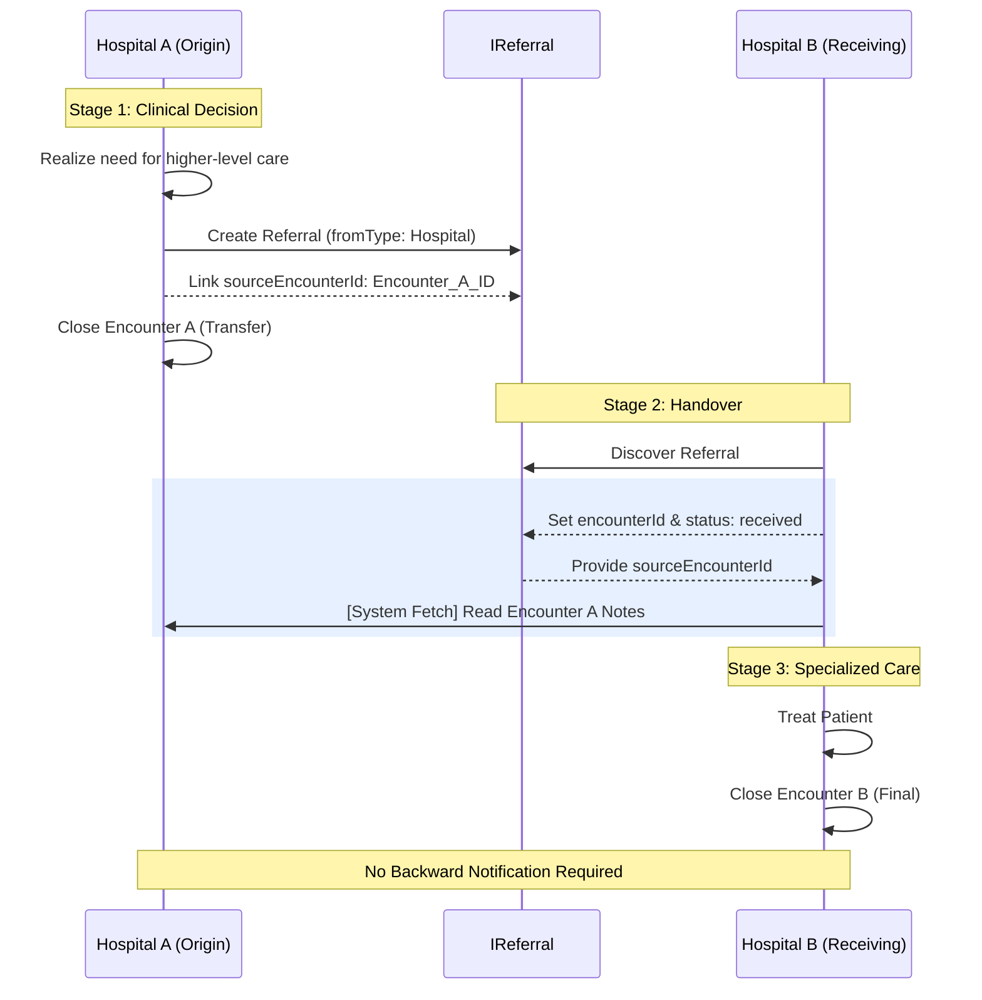
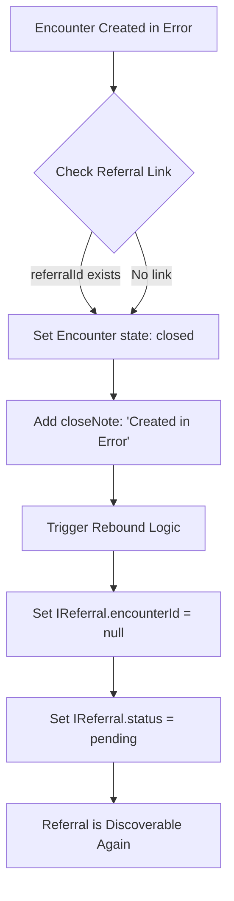
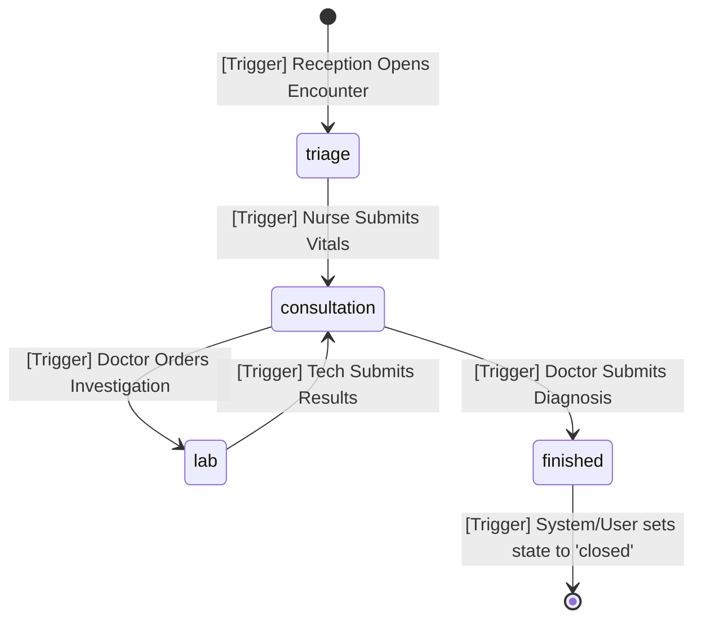

## Referral & Encounter Integration: Architectural Specification

This document formalizes the mechanical relationship and data flow between **Referrals** and **Encounters** across the healthcare hierarchy.

---

### 1. Data Schema Architecture

#### Encounter Document
* **`id`**: Unique identifier.
* **`initiator`**: User ID who opened the encounter.
* **`state`**: `open` | `closed`.
* **`closeNote`**: Clinical summary (null while open).
* **`referralId`**: Optional link to an incoming `IReferral`.
* **`patientNumber`**: Unique patient identifier for discovery.
* **`openedAt`**: Timestamp of encounter creation.
* **`closedAt`**: Timestamp of encounter closure.
* **`hospitalId`**: ID of the hospital where the encounter is active.
* **`currentStep`**: `triage` | `consultation` | `lab` | `finished`.
* **`urgency`**: `low` | `medium` | `high` | `emergency`.
* **`diagnoses`**: `Array<IDiagnosis>`
    * **`code`**: String; ICD-11 identifier (e.g., `1F40`).
    * **`description`**: String; Human-readable clinical name.
    * **`isPrimary`**: Boolean; Identifies the chief reason for the encounter.
    * **`results`**: `Array<IFinding>` — Denormalized evidence supporting the conclusion.
        * **`status`**: `positive` | `negative`.
        * **`note`**: String; Free-text for additional context (e.g., "BP 90/60 mmHg"). 

##### Field Description: urgency
The urgency field is a clinical priority marker typically assigned during the triage step. It acts as the primary sorting mechanism for department queues, ensuring that life-threatening cases (emergency) are surfaced at the top of the dashboard, regardless of arrival time, while stable cases are handled in chronological order.

#### Referral Document (`IReferral`)
* **`fromType`**: `Hospital` | `CommunityHealthUnit`.
* **`status`**: `pending` | `received` | `completed`.
* **`encounterId`**: Link to the **active** receiving encounter.
* **`outcomeNote`**: Denormalized `closeNote` for CHU visibility. (If possible, will be replaced by encounterId of the referred to hospital only if the referral is from a CHU)
* **`assessments`**: Array of IDs for community screening data. Optional, only available for CHU referrals. Not used for hospital-to-hospital transfers.

---

### 2. Workflow Diagrams

##### Creation process

###### Patient Alredy exists with Patient Number
- Nurse search patient by patient number
- System Checks if there is an existing open encounter for the patient
    - To Be discussed: No multiple open encounter for a patient are allowed
- System checks if there is an existing referral for the patient.
    - If so, referral is linked to the encounter and referral status is updated to "In Progress"
    - If not, encounter is created without referral link
        - currentStep is set to "triage"
- If patient does not exists, nurse creates new patient and encounter is created without referral link
    - currentStep is set to "triage"

#### A. Community-to-Hospital (Feedback Loop)
*Logic: The CHU needs to know the outcome for community follow-up.*

#### B. Hospital-to-Hospital (Clinical Handover)
*Logic: Professional context moves forward; no backward "ping" required.*

---

### 3. Error Handling: The Rebound Mechanic
To prevent administrative errors from "burning" a valid referral, the system must support an atomic reset.

---

### 4. Summary Table

| Source Type | Hospital Input Source | Feedback Logic |
| :--- | :--- | :--- |
| **CHU / Campaign** | `IReferral.assessments` | **Active:** Update `outcomeNote` & `status`. |
| **Hospital** | `IReferral.sourceEncounterId` | **Passive:** Forward context only. |

## 5. The Operational Workflow (`currentStep`)

The `currentStep` field acts as a **logical baton**, determining which department "owns" the patient record at any given time. While the `state` remains `open`, the `currentStep` dictates the UI visibility and the allowed clinical actions.

### A. Lifecycle Diagram

### B. Step-by-Step Mechanical Detail

| Current Step | Primary Actor | Data Responsibilities | UI Logic (Dashboard) |
| :--- | :--- | :--- | :--- |
| **`triage`** | Nurse | Record Vitals (BP, Temp, Weight) and Urgency Score. | Encounter appears on **Nurse Queue**. |
| **`consultation`** | Doctor | Review Vitals, perform Physical Exam, prescribe Medication, or request Labs. | Encounter appears on **Doctor Queue**. |
| **`lab`** | Lab Tech | Collect samples, process tests, and record numerical/categorical results. | Encounter appears on **Lab Queue**. |
| **`finished`** | Doctor / Clerk | Finalize the `closeNote` (summary) and discharge the patient. | Encounter appears on **Discharge/Admin Queue**. |

### C. Logic of the "Lab Loop"
The transition from `lab` always returns to `consultation`. This is a strict mechanical requirement:
* **The Block:** A patient cannot move from `lab` to `finished`. 
* **The Reason:** A doctor must interpret the results of a lab test before a clinical outcome (`closeNote`) can be finalized.
* **The Action:** Saving lab results automatically triggers `currentStep: 'consultation'`.

### D. Closure Sequence
The move to the terminal state requires two distinct actions to maintain data integrity:
1.  **Clinical Completion:** The `currentStep` is moved to `finished` by the doctor.
2.  **Administrative Closure:** The system (or a clerk) sets `state: 'closed'`, which populates `closedAt` and triggers the **Referral Feedback Loop** (if the source was a CHU).

---

### Key Developer Notes for Implementation
* **Dashboard Filtering:** `const myQueue = encounters.filter(e => e.currentStep === userRole && e.state === 'open');`
* **Concurrency:** By updating `currentStep` at the end of each submission, you prevent two departments from accidentally editing the same encounter simultaneously.
* **Audit Trail:** Every change to `currentStep` should ideally be logged with a timestamp to calculate departmental "turnaround time" (TAT).

## 6. Attension
- Is there aposibility that a counter would be created and does not link to referral yet a referral exists? SOlved
- What if patient goes ot hospital with a referral but before due date?
    - Option one, reject
    - Option 2, probably patient is very sick, let nurse decide, show the warning "Patient has a pending referral due on {{dueDate}}. We advise you wait until the due date. if patient is very sick, you can proceed.    