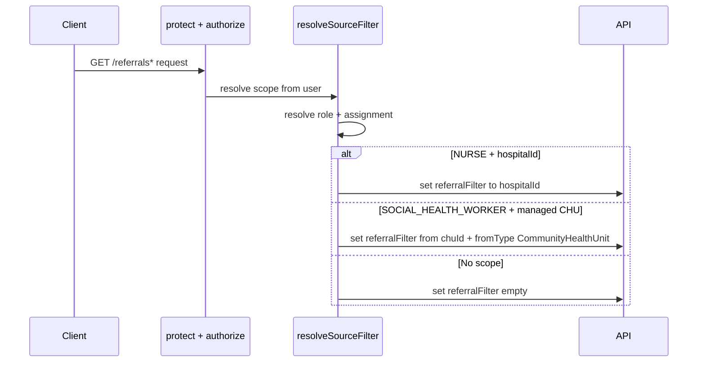
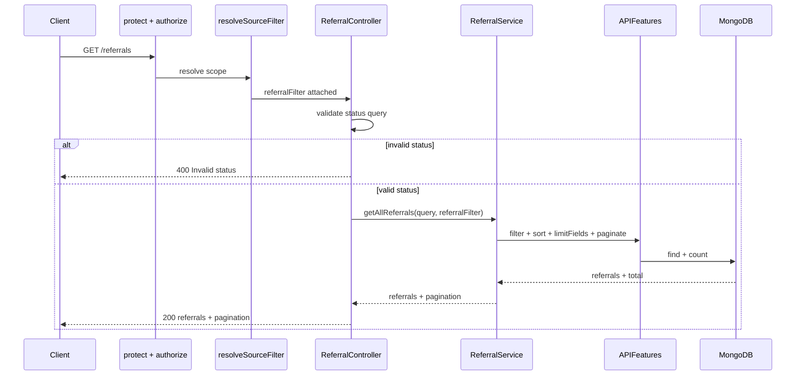
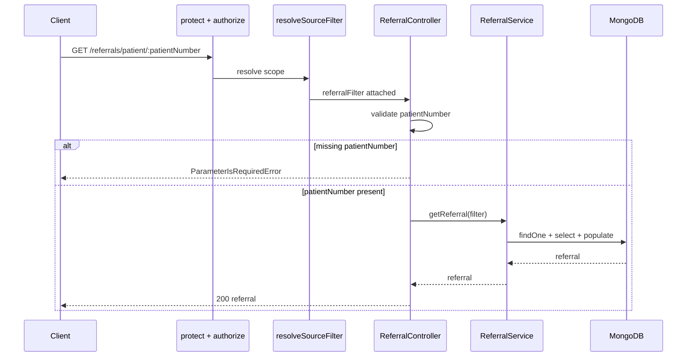

# Referral Retrieval APIs (Developer/Engineer)

Implementation flow and query behavior for referral retrieval endpoints. Intended for backend engineers and API maintainers.

## Endpoint Inventory

* **GET /referrals**: List referrals in the caller's source scope. Roles: `SOCIAL_HEALTH_WORKER`, `NURSE`.
* **GET /referrals/patient/:patientNumber**: Get single referral by patient number within scope. Roles: `SOCIAL_HEALTH_WORKER`, `NURSE`.

## Shared Source Filter Resolution (resolveSourceFilter)

## Get All Referrals (GET /referrals)

**Query handling (APIFeatures)**
* Controller validates `status` query against `PENDING`, `COMPLETED`, `CANCELLED` before executing the query.
* Filtering: excludes `page`, `sort`, `limit`, `fields`; supports `gte`, `gt`, `lte`, `lt` operators; date strings (YYYY-MM-DD) converted to Kigali day start (UTC) before hitting Mongo.
* Sorting: `sort` param (comma-separated), default `-createdAt`.
* Field limiting: `fields` param, default excludes `__v`.
* Pagination: `page`/`limit` with defaults page=1, limit=20, max limit=200; response includes `PaginationMeta`.

## Get Referral By Patient Number (GET /referrals/patient/:patientNumber)

**Single-referral filter and shape**
* Filter composition: `{ patientNumber: Number(...), ...req.referralFilter }`.
* Projection: `_id`, `patientNumber`, `from`, `fromType`, `to`, `scheduledVisitDate`, `status`.
* Population: `from` and `to` resolved with full documents.
